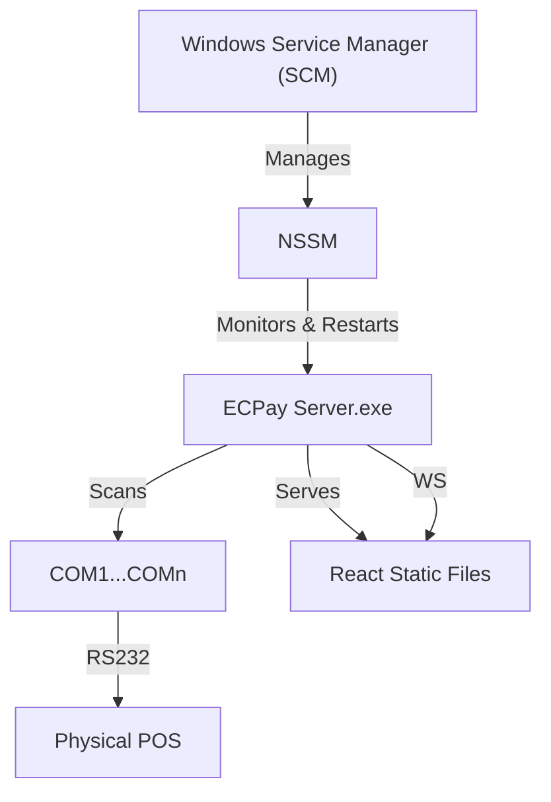

# Windows Deployment & Reliability Guide

## 1. Hardware Auto-Detection (RS232)

To satisfy the requirement of **"Automatic recognition of POS hardware"**, we cannot rely on fixed COM ports (e.g., `COM1`), as these assignations change based on USB insertion order or hardware configuration.

### Implementation Strategy: "Active Probing"

The Server should implement an auto-scanning mode on startup:

1. **List Ports**: Use a library (e.g., `go.bug.st/serial`) to enumerate all available system serial ports.
2. **Probe**: For each candidate port:
    * Open with standard ECPay settings: `115200/8/N/1`.
    * Send an **ECHO Command** (`TransType 80`).
    * Wait 200ms-500ms for a response.
3. **Identify**:
    * If a valid frame (STX...ETX+LRC) is received:
        * Validate LRC.
        * Check if Response Code is `0000` (Approved) or similar echo response.
    * **Success**: Lock this port and start the main service loop.
    * **Failure**: Close port and try the next one.
4. **Fallback**: If no device is found, log an error and retry every X seconds, or enter a "Device Missing" state in the Webapp.

### Go Code Snippet Concept

```go
func ScanForPOS() (string, error) {
    ports, _ := serial.GetPortsList()
    for _, port := range ports {
        conn, err := driver.OpenSerial(port, 115200)
        if err == nil {
            // Send ECHO
            conn.Write(BuildPacket(ECHO_REQUEST))
            
            // Wait for response
            buf := make([]byte, 1024)
            n, _ := conn.Read(buf)
            if protocol.ValidatePacket(buf[:n]) {
                return port, nil // Found!
            }
            conn.Close()
        }
    }
    return "", errors.New("no POS device found")
}
```

---

## 2. Windows Service & Reliability

To maximize reliability and use Windows native daemons, we recommend using **NSSM (Non-Sucking Service Manager)**. It allows any executable to run as a Windows Service with robust process monitoring.

### Why NSSM?

* **Automatic Restart**: If the process crashes (even if it's a `panic`), NSSM restarts it immediately.
* **Throttling**: Prevents CPU spin if the app crashes instantly on loop.
* **I/O Redirection**: Captures `stdout`/`stderr` to log files, essential for long-running background services.
* **Environment Variables**: Easy management of configured paths.

### Installation Steps

1. Download `nssm.exe` (Latest release).
2. Open Administrator Terminal.
3. Install service:

    ```powershell
    nssm.exe install ECPayPosServer "C:\Path\To\start_windows.bat"
    ```

4. Configure reliability (GUI or CLI):
    * **Exit actions**: Restart application (Default).
    * **Throttle**: Delay restart by 1s (Matches our `run_dev.sh` logic, but handled by OS).

---

## 3. Auto-Start on Boot

By installing as a Windows Service, the application automatically adheres to Windows "Service Startup Types":

* **Automatic**: Starts when Windows boots (User does not need to log in).
* **Automatic (Delayed Start)**: Good if the service relies on other drivers being loaded first (e.g., USB-to-Serial drivers). **Recommended for POS**.

### Configuration via NSSM

```powershell
nssm.exe set ECPayPosServer Start SERVICE_DELAYED_AUTO_START
```

---

## 4. Webapp Deployment (Bundled)

Running a separate `npm run dev` process on a production Windows machine is fragile.

### Best Practice: Embed Webapp in Server

1. **Build**: Run `npm run build` in `webapp/`. This produces a `dist/` folder.
2. **Embed**: Use Go 1.16+ `embed` directive or a file server handler to serve `dist/` from the Go server itself.

**Updated `main.go` Logic**:

```go
// Serve static files
fs := http.FileServer(http.Dir("./webapp/dist"))
http.Handle("/", fs)
http.Handle("/ws", wsHandler)
```

### Advantages

* **Single Artifact**: You deploy ONE binary (`ecpay-server.exe`).
* **Port Consolidation**: Webapp and WebSocket run on the same port (`8989`). No CORS issues.
* **Atomic Updates**: Updating the exe updates both backend logic and frontend UI.

---

## Summary of Windows Production Architecture



### Action Plan

1. **Modify Server**: Add `ScanForPOS` logic and Static File serving.
2. **Build Script**: Create a `build_windows.bat` that builds React app and Go binary.
3. **Install Script**: Create `install_service.bat` using NSSM commands.
